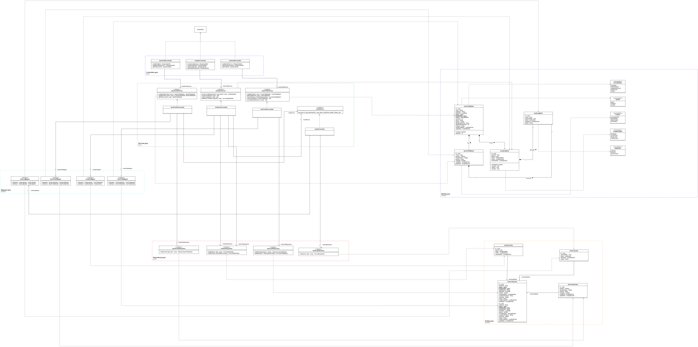
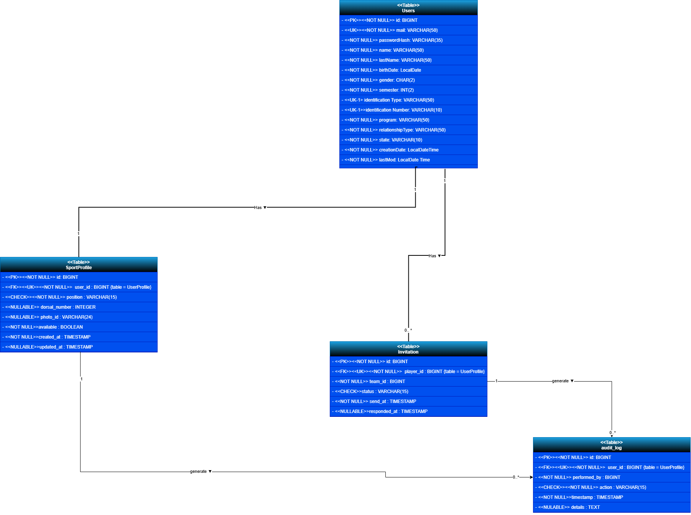

# TECHCUP FÚTBOL 

> [!IMPORTANT]
> Este repositorio contiene el **BackEnd** para el servicio de **[Usuarios y Jugadores]**

> [!NOTE]
> Gestiona la información de los participantes del torneo y su perfil deportivo

| Funcionalidad | Descripción |
|---------------|-------------|
| **Actualizar usuario** | El usuario y el administrador podrán actualizar la información básica del usuario: nombre completo, relación con la Escuela (estudiante, profesor, administrativo, graduado o familiar), programa académico, semestre (si es estudiante). El correo y la contraseña no se podrán modificar. |
| **Crear perfil deportivo** | Cada jugador podrá crear un perfil deportivo indicando: posición de juego predefinida (portero, defensa, volante, delantero), número dorsal predefinido, foto y si se encuentra disponible o no para ser convocado por algún equipo. |
| **Actualizar perfil deportivo** | El jugador podrá actualizar todos los datos de su perfil deportivo siempre y cuando no esté asignado a un equipo. |
| **Eliminar perfil deportivo** | El sistema no permitirá eliminar un perfil deportivo. |
| **Búsqueda de jugadores** | Los capitanes podrán buscar jugadores por: posición, edad, género, nombre, identificación y/o semestre. |
| **Invitaciones** | Los jugadores podrán recibir invitaciones de equipos y aceptar o rechazar invitaciones. |
| **Auditoría** | Registrar las acciones de actualización e inactivación de usuarios. Y de gestión del perfil. |
---

## Integrantes

* **Product Owner:** [JUAN SEBASTIÁN GUAYAZÁN CLAVIJO](https://github.com/JuanGuayazanC) → [juan.guayazan-c@mail.escuelaing.edu.co](mailto:juan.guayazan-c@mail.escuelaing.edu.co)
* **Líder técnico:** [BRAYAN LOAIZA LEAL](https://github.com/brloa05) → [brayan.loaiza-l@mail.escuelaing.edu.co](mailto:brayan.loaiza-l@mail.escuelaing.edu.co)
* **Analista funcional:** [JUAN ESTEBAN CRUZ RICO](https://github.com/Cruz-Juan-r) → [juan.cruz-r@mail.escuelaing.edu.co](mailto:juan.cruz-r@mail.escuelaing.edu.co)
* **Desarrollador:** [JUAN JOSÉ LAVERDE RÍOS](https://github.com/juanlaverde777) → [juan.laverde-r@mail.escuelaing.edu.co](mailto:juan.laverde-r@mail.escuelaing.edu.co)
* **Desarrollador:** [JUAN MANUEL VILLEGAS MEDINA](https://github.com/juanmavill) → [juan.vmedina@mail.escuelaing.edu.co](mailto:juan.vmedina@mail.escuelaing.edu.co)

---

## Stack tecnológico

### Backend


### Base de Datos


### Testing & Calidad


### Herramientas & DevOps


---

## Requisitos previos

| Herramienta | Versión mínima |
|-------------|----------------|
| Java | 17+ (recomendado 21) |
| Maven | 3.8+ |
| Docker | 24+ (opcional) |
| PostgreSQL | 13+ (si aplica) |

---

## Estructura del proyecto

### Árbol de directorios

```
📦 nombre-del-servicio/
├── 📂 .azure/
│   └── 📄 azure-pipelines.yml      # Pipeline CI/CD Azure DevOps
├── 📂 src/
│   ├── 📂 config/                  # Configuración global y variables de entorno
│   ├── 📂 modules/
│   │   └── 📂 [modulo]/
│   │       ├── 📄 [modulo].controller.ts
│   │       ├── 📄 [modulo].service.ts
│   │       ├── 📄 [modulo].module.ts
│   │       ├── 📂 dto/             # Objetos de transferencia de datos
│   │       ├── 📂 entities/        # Entidades TypeORM
│   │       └── 📂 guards/          # Guards de autenticación y autorización
│   ├── 📄 app.module.ts
│   └── 📄 main.ts
├── 📂 test/                        # Pruebas e2e
├── 📄 .env.example
├── 📄 Dockerfile
├── 📄 jest.config.ts
├── 📄 package.json
├── 📄 tsconfig.json
└── 📄 README.md
```

---

## Configuración local

### 1. Clonar el repositorio
```bash
git clone https://github.com/org/nombre-del-servicio.git
cd nombre-del-servicio
```

---

### 2. Compilar el proyecto
```bash
mvn clean install
```

> [!NOTE]
> Este comando descarga dependencias y compila el proyecto.

---

### 3. Configurar variables de entorno

Puedes usar variables de entorno del sistema o modificar:

```plaintext
src/main/resources/application.properties
```

Ejemplo:

```properties
server.port=8080

spring.datasource.url=jdbc:postgresql://localhost:5432/nombre_db
spring.datasource.username=usuario
spring.datasource.password=contraseña

jwt.secret=clave_secreta
jwt.expiration=3600000
```

---

### 4. Ejecutar en desarrollo
```bash
mvn spring-boot:run
```

> [!TIP]
> El servicio se ejecutará en:
>
> http://localhost:8080

---

### 5. Ejecutar en modo empaquetado
```bash
mvn clean package
java -jar target/nombre-del-servicio.jar
```

---

### Ejecución con Docker

#### Construir la imagen
```bash
docker build -t nombre-del-servicio .
```

#### Ejecutar el contenedor
```bash
docker run -d \
  --name nombre-del-servicio \
  -p 8080:8080 \
  nombre-del-servicio
```

> [!TIP]
> Swagger estará disponible en:
>
> http://localhost:8080/swagger-ui.html

---

## Arquitectura

El servicio sigue una **Arquitectura Modular** propia de NestJS, con separación estricta de responsabilidades por módulo de dominio:

```
Controller → Service → Repository → Base de datos
```

| Elemento | Responsabilidad |
|----------|----------------|
| `Controller` | Recibir y responder peticiones HTTP |
| `Service` | Lógica de negocio |
| `Repository` | Acceso y persistencia de datos (TypeORM) |
| `Entity` | Representación de tablas en base de datos |
| `DTO` | Validación y transferencia de datos entre capas |
| `Guard` | Control de acceso y autenticación |
| `Module` | Encapsulación y organización por dominio |

| Decorador | Capa |
|-----------|------|
| `@Controller` | Controller |
| `@Injectable` | Service |
| `@Entity` | Entity |
| `@Module` | Module |

---

## Modelación

### Diagrama de contenedores


> Descripción de cómo este servicio interactúa con los demás componentes del sistema.

### Diagrama de clases



> Descripción de las principales clases y sus relaciones.

### Diagrama Entidad-Relación



> Descripción del modelo de datos y las relaciones entre tablas.

---

## API y Endpoints

La documentación interactiva está disponible vía Swagger una vez el servicio esté en ejecución:

```
http://localhost:3000/api
```


### Resumen de endpoints

### Resumen de endpoints

| Método | Endpoint | Descripción |
|--------|----------|-------------|
| GET | `/api/users` | Listar todos los usuarios |
| GET | `/api/users/{id}` | Obtener usuario por ID |
| GET | `/api/users/identification/{identification}` | Obtener usuario por identificación |
| POST | `/api/users` | Crear nuevo usuario |
| PUT | `/api/users/{id}` | Reemplazar usuario completo (admin) |
| PUT | `/api/users/me` | Actualizar el perfil del usuario actual (`X-User-Id`) |
| PATCH | `/api/users/{id}/deactivate` | Desactivar usuario (estado INACTIVE) |
| PATCH | `/api/users/{id}/inactivate` | Inactivar usuario validando participación en torneo |
| GET | `/api/invitations/{id}` | Obtener invitación por ID |
| GET | `/api/invitations/player/{playerId}` | Listar invitaciones recibidas por jugador |
| POST | `/api/invitations/player/{playerId}/team/{teamId}` | Enviar invitación a jugador desde equipo |
| PATCH | `/api/invitations/{id}/accept` | Aceptar invitación |
| PATCH | `/api/invitations/{id}/reject` | Rechazar invitación |
| PATCH | `/api/invitations/{id}/cancel` | Cancelar invitación pendiente |
| GET | `/api/sport-profiles/{id}` | Obtener perfil deportivo por ID |
| GET | `/api/sport-profiles/user/{userId}` | Obtener perfil deportivo por usuario |
| POST | `/api/sport-profiles/user/{userId}` | Crear perfil deportivo para usuario (multipart: `profile`, `photo` opcional) |
| PUT | `/api/sport-profiles/{id}` | Actualizar perfil deportivo (multipart: `profile`, `photo` opcional) |
| PATCH | `/api/sport-profiles/{id}/availability?available={true\|false}` | Actualizar disponibilidad del perfil deportivo |

### Versionamiento de la API

| Tipo | Cuándo se incrementa |
|------|----------------------|
| `MAJOR` | Cambios que rompen compatibilidad |
| `MINOR` | Nueva funcionalidad compatible hacia atrás |
| `PATCH` | Corrección de bugs |

---

## Seguridad

- Autenticación mediante **JWT** gestionado con Guards de NestJS.
- Todos los endpoints (excepto `/auth/**`) requieren token en el header:

```
Authorization: Bearer <token>
```

- Las contraseñas se almacenan con **bcrypt**.
- La autorización por roles se implementa con **Guards** y **Decoradores** personalizados.

> [!WARNING]
> Nunca subas al repositorio archivos `.env` ni credenciales de ningún tipo. Usa siempre `.env.example` como referencia.

---

## Manejo de errores

NestJS maneja las excepciones de forma centralizada mediante **ExceptionFilters**. El formato estándar de error es:

```json
{
  "statusCode": 404,
  "timestamp": "2025-01-01T00:00:00Z",
  "path": "/api/v1/recurso/5",
  "message": "El recurso con id 5 no existe"
}
```

| Código | Significado |
|--------|-------------|
| `200` | OK |
| `201` | Creado exitosamente |
| `400` | Solicitud inválida |
| `401` | No autenticado |
| `403` | Sin permisos |
| `404` | Recurso no encontrado |
| `500` | Error interno del servidor |

---

## Calidad de código y pruebas

### Pruebas unitarias (Jest)

```bash
# Ejecutar pruebas unitarias
npm run test

# Ejecutar con cobertura
npm run test:cov

# Ejecutar pruebas e2e
npm run test:e2e
```


### Análisis estático (SonarQube)


```bash
# Ejecutar análisis local
npx sonar-scanner \
  -Dsonar.projectKey=<PROJECT_KEY> \
  -Dsonar.host.url=<SONAR_HOST_URL> \
  -Dsonar.token=<SONAR_TOKEN>
```

### Pruebas de integración (Postman / Newman)


```bash
npm install -g newman
newman run collection.json
```

---

## Atributos de calidad

| Atributo | Estrategia aplicada |
|----------|-------------------|
| **Mantenibilidad** | Arquitectura modular NestJS, principios SOLID, TypeScript estricto |
| **Testeabilidad** | Jest, mocks con providers de NestJS, cobertura por módulo |
| **Seguridad** | JWT, Guards, validación con class-validator, bcrypt |
| **Disponibilidad** | Pipeline CI/CD en Azure DevOps, despliegue en Azure Container Instances |
| **Observabilidad** | Logs estructurados, análisis estático con SonarQube |
| **Escalabilidad** | Contenedores Docker, servicio sin estado (stateless) |

---

## CI/CD

El proyecto utiliza **Azure DevOps Pipelines** para automatizar la integración y el despliegue continuo.

### Flujo general

```
Push / PR → CI (build + test + sonar) → CD (docker build + push + deploy en Azure)
```

### Integración Continua (CI)

Se dispara en cada `push` o `pull request` hacia `main` o `develop`.

| Paso | Descripción |
|------|-------------|
| Install | Instala dependencias con npm |
| Build | Compila el proyecto TypeScript |
| Tests | Ejecuta pruebas unitarias con Jest |
| Cobertura | Genera reporte de cobertura |
| SonarQube | Análisis estático de calidad |

### Despliegue Continuo (CD)

Se dispara al hacer `push` a `main` una vez el CI ha pasado.

| Paso | Descripción |
|------|-------------|
| Docker build | Construye la imagen del servicio |
| Docker push | Publica la imagen en Azure Container Registry |
| Deploy | Despliega en Azure Container Instances |

### Entorno de despliegue

| Campo | Valor |
|-------|-------|
| Plataforma | Azure Container Instances |
| URL del servicio | [https://url-del-servicio.azurecontainer.io](https://url-del-servicio.azurecontainer.io) |
| Swagger desplegado | [https://url-del-servicio.azurecontainer.io/api](https://url-del-servicio.azurecontainer.io/api) |
| Rama de producción | `main` |

---

## Convenciones del proyecto

### Ramas

| Rama | Propósito |
|------|-----------|
| `main` | Producción |
| `develop` | Integración |
| `feature/nombre` | Nueva funcionalidad |
| `fix/nombre` | Corrección de bug |
| `hotfix/nombre` | Corrección urgente en producción |

### Pull Requests

- Todo PR apunta a `develop`, nunca directamente a `main`.
- El PR debe pasar el pipeline de CI antes de ser mergeado.
- Se requiere al menos **2 aprobación** de otro integrante.

---

## Licencia

Este proyecto es de uso académico y pertenece a la **Escuela Colombiana de Ingeniería Julio Garavito** en el marco del curso de Desarrollo y Operaciones Software.
